# Conference Platform Microservices Application

Application de gestion de conférences avec architecture microservices - Spring Boot + Angular

## Technologies

**Backend:** Spring Boot 3.5.7, Spring Cloud 2025.0.0, Eureka Discovery, Spring Cloud Gateway, Spring Cloud Config, OpenFeign, Resilience4J, SpringDoc OpenAPI 2.3.0, H2 Database, Java 21

**Frontend:** Angular 19, TypeScript

## Description

Cette application permet de gérer des conférences assurées par des Keynote speakers. Elle utilise une architecture microservices moderne avec Spring Boot et Angular.

## Architecture

  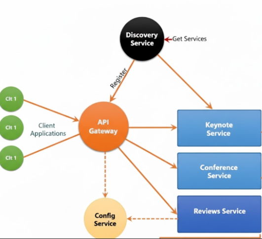

L'application est composée de 6 microservices:

1. **discovery-service** (port 8761) - Eureka Server pour la découverte de services
2. **config-service** (port 9999) - Configuration centralisée avec Spring Cloud Config
3. **gateway-service** (port 8888) - API Gateway pour le routage des requêtes
4. **keynote-service** (port 8081) - Gestion des keynote speakers
5. **conference-service** (port 8083) - Gestion des conférences et reviews

## Documentation

### Backend Services

#### Eureka Discovery Service

Service de découverte permettant l'enregistrement et la localisation dynamique des microservices.

  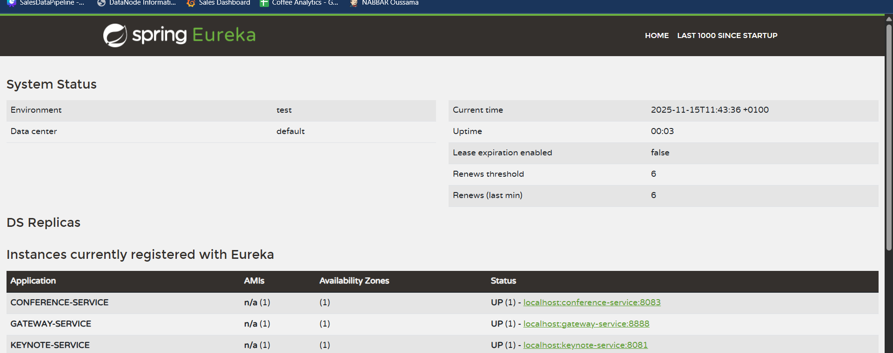

#### Gateway Service

API Gateway pour le routage intelligent des requêtes vers les microservices appropriés.

  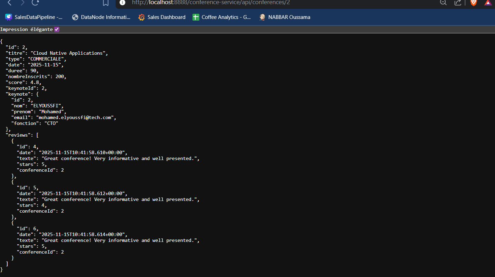

  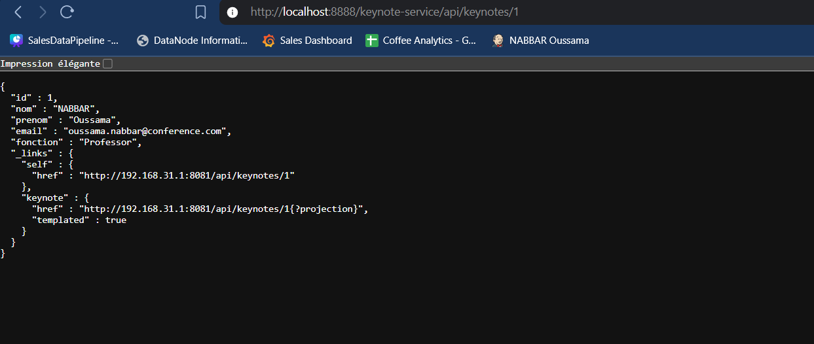

#### Keynote Service

Service de gestion des keynote speakers avec API REST complète (CRUD).

  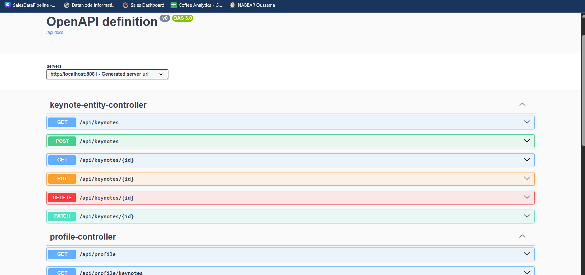

  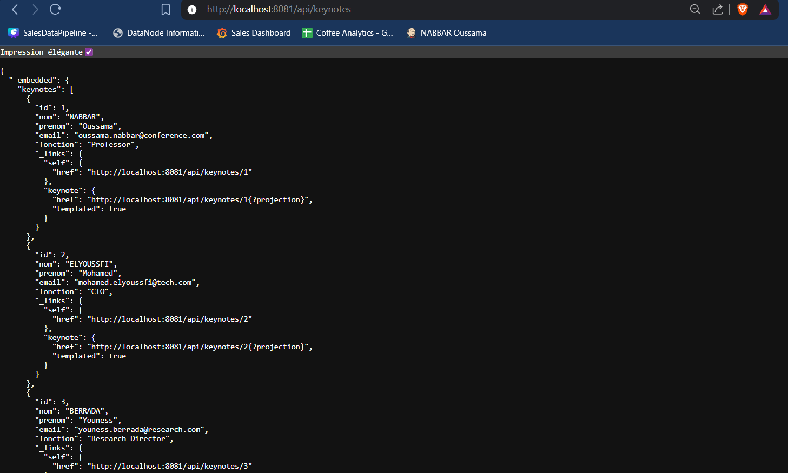

#### Conference Service

Service de gestion des conférences et reviews avec communication OpenFeign vers le Keynote Service.

  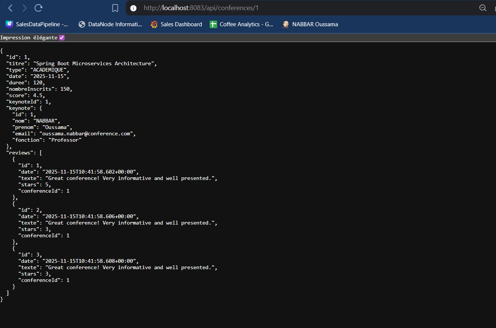

#### Config Service

Service de configuration centralisée pour gérer les configurations de tous les microservices avec Spring Cloud Config.

  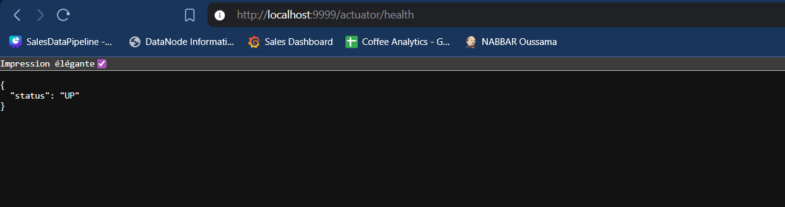

### Frontend Application

Application Angular 19 avec interface utilisateur moderne pour la gestion des conférences et keynote speakers.

#### Gestion des Keynotes

Liste et gestion des keynote speakers avec opérations CRUD complètes.

  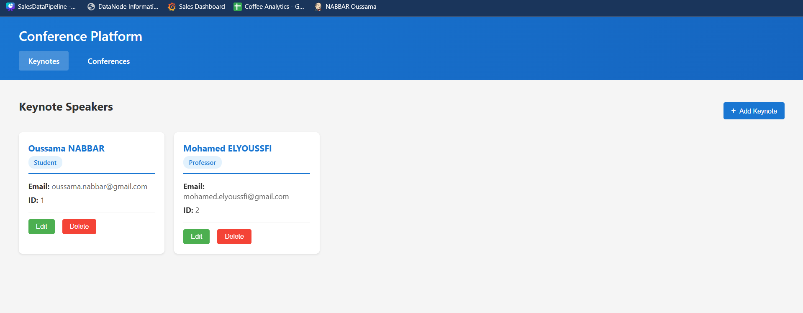

#### Gestion des Conférences

Liste et gestion des conférences avec leurs détails et reviews.

  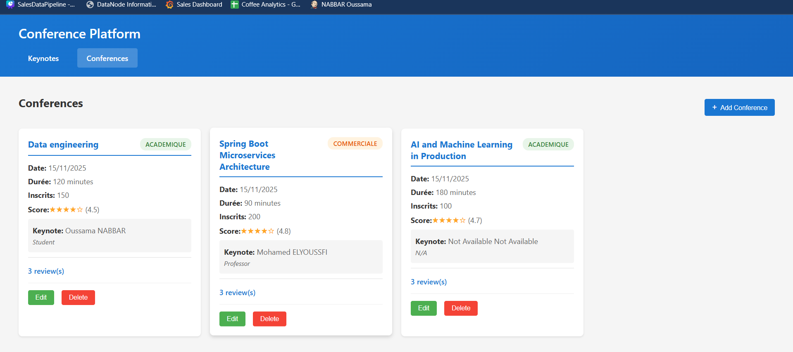

#### Chatbot Service

This service provides a chatbot for the Conference Platform. It helps users find information about keynote speakers and conferences. Users can ask things like:
- "Who are the keynote speakers?"
- "What conferences are available?"
- "Tell me about the Spring Boot conference"
The chatbot uses the Deepseek API key to communicate with the backend and fetch relevant information.

  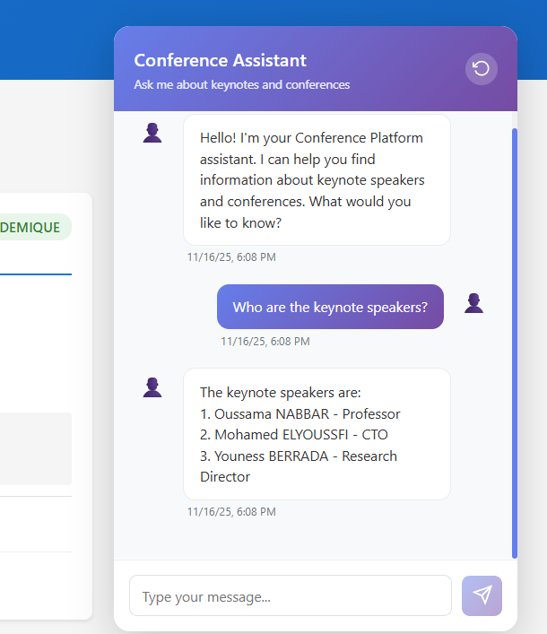

  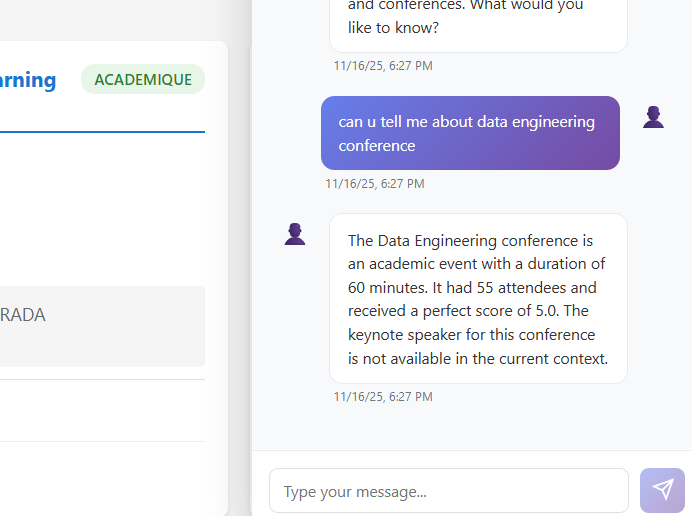

  Built with Spring Boot & Angular - Conference Platform

